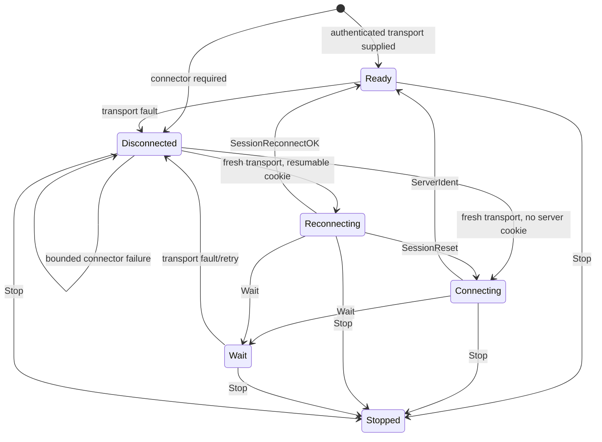

# P02 Architecture and State

## Ownership and Bounds

| Area | Owner | Contract |
| --- | --- | --- |
| Banner | `internal/msgr/banner.go` | Encodes and validates the v2 banner and supported revision negotiation. |
| CRC framing | `internal/msgr/frame.go` | Owns preamble descriptors, CRC32C, alignment, late status, and one-to-four segment bounds. |
| Secure framing | `internal/msgr/secure.go` | Owns AES-128-GCM direction mapping and per-record nonce counters for one authenticated transport. |
| Control/message payloads | `internal/msgr/control.go`, `message.go` | Own typed payload encoding, decoding, and configured size/address/auth bounds. |
| Session | `internal/msgr/session.go` | One owner goroutine controls state, sequence and transaction IDs, pending/replay sets, retained bytes, reconnect limits, and transition limits. |
| Transport | `internal/msgr.Transport` | An already authenticated framed connection; `Close` must interrupt blocked reads and writes. Crypto counters remain transport-owned. |
| Connector | `internal/msgr.Connector` | Produces a fresh authenticated transport while session and replay identity remain session-owned. |

`Limits`, `MaxQueuedMessages`, `MaxRetainedBytes`,
`MaxInFlightTransactions`, `MaxReconnectAttempts`, and
`MaxHandshakeTransitions` reject or terminate work before unbounded resource
growth. Caller messages are cloned at submission. Read and write pumps report
generation-tagged results to the owner so stale transports cannot mutate the
active session.

P02 contains no socket dialer, CephX exchange, monitor handshake, or live
cluster path. Fake transports and scripted peers exercise the session contract.

## State Machine

`SessionRetry` and `SessionRetryGlobal` remain in `Reconnecting` while updating
bounded reconnect identity. A partial reset enters `Connecting` and preserves
eligible replay identity; a full reset clears cookies, counters, replay state,
and pending calls before starting a fresh identification exchange. Connector
errors and transport faults consume `MaxReconnectAttempts` and immediately
queue the next connector request. The current session has no retry timer,
delay, jitter, or exponential backoff; callers must not infer backoff behavior
from the bounded attempt count.